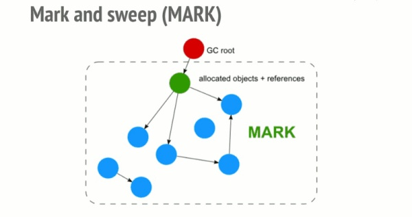

### 内存泄露就是由于疏忽或错误造成程序未能释放那些已经不再使用的内存，造成内存的浪费。

#### 常见的内存泄漏：

  1.意外的全局变量
  ``` javascript
    function demo(){
      a='意外的全局标量'
    }
  ```
  
  2.被遗忘的定时器和回调函数
  
  3.常见的闭包
  
  4.DOM的引用
  很多时候, 我们对 Dom 的操作, 会把 Dom 的引用保存在一个数组或者 Map 中。
  ``` javascript
       var elements = {
        image: document.getElementById('image')
    };
    function doStuff() {
        elements.image.src = 'http://example.com/image_name.png';
    }
    function removeImage() {
        document.body.removeChild(document.getElementById('image'));
        // 这个时候我们对于 #image 仍然有一个引用, Image 元素, 仍然无法被内存回收.
    }
```
  所以我们要小心处理对于 Dom 元素的引用。
  
  ### 垃圾回收机制
  
  #### 引用计数回收算法  
  看一个对象是否有指向它的引用。 如果没有其他对象指向它了，说明该对象已经不再需了。 这是最初的垃圾回收算法
  
  
  #### 标记清除回收算法
  就是从根部（在JS中就是全局对象）出发定时扫描内存中的对象。 凡是能从根部到达的对象，都是还需要使用的。 那些无法由根部出发触及到的对象被标记为不再使用，稍后进行回收。
  
  
  
  
  
  
  
  
  
  
  
  
  
  
  
  
  
  
